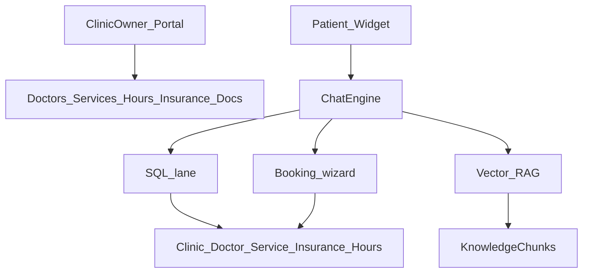

# Three-clinic real-data seed + schema fit

## Verdict

**Yes — Synapse can store and serve these 3 clinics today** for booking, SQL chat (hours/doctors/services/insurance), and RAG policy answers.

It is **tenant-scoped by design**: each clinic is an isolated row graph (`Clinic` → doctors, services, specialties, insurance, hours, widget config, knowledge). Family medicine, dental, and dermatology are different *content*, not different *architectures*.

What does **not** fit as first-class SQL fields yet (put in RAG docs / `metadata` for this pass): DPC membership SOPs, deposit rules, cancellation windows, in-network vs OON nuance beyond accept/reject, Botox $/unit quantity math, Medicaid walk-in exceptions.

---

## How data maps today

| Your data | Where it lives |
|---|---|
| Name, phone, email, address, timezone | [`Clinic`](apps/clinics/models.py) |
| Operating hours (incl. closed Sunday) | [`ClinicBusinessHours`](apps/clinics/models.py) |
| Doctors / FNP / PA | [`Doctor`](apps/doctors/models.py) — `title` = `MD, FAAFP` / `FNP-C` / `PA-C` / `DDS`; languages; schedule via [`DoctorSchedule`](apps/doctors/models.py) |
| Specialties | [`Specialty`](apps/specialties/models.py) + `DoctorSpecialty` |
| Services, duration, cash price | [`Service`](apps/services/models.py) — `price_cents`, `duration_min` |
| Service code (SRV-FM-01, DNT-…) | **Gap** → add optional `code` + `category` (small migration) |
| Insurance accepted / not | [`InsurancePlan`](apps/insurance/models.py) `is_accepted` + `notes`; link doctors via `DoctorInsurance` |
| NPI | **Gap** → `Doctor.metadata.npi` for now (or add `npi` column later) |
| Membership / cancel / cosmetic self-pay rules | **Knowledge docs** (RAG) — already how policy questions are routed |
| Booking UX | [`WidgetSettings.configuration`](apps/widget/models.py) per clinic |

---

## How clinic owners use Synapse (product loop)

1. **Onboard** — create clinic (slug), hours, specialties, doctors + schedules, services + prices, insurance list.
2. **Knowledge** — upload SOPs (cancellation, membership, cosmetic self-pay, post-op) so RAG answers policy Qs SQL cannot.
3. **Widget** — embed `/embed/{slug}`; booking + Q&A run against *that* tenant only.
4. **Operate** — portal appointments/patients/analytics; Super Admin can Enter clinic without role swap.

Three verticals prove the same loop with different catalogs (urgent care vs Invisalign vs Botox).

---

## Gaps: ship vs defer

### Ship with this seed (minimal schema)

Add to `Service` only:

- `code` (CharField, blank) — `SRV-FM-01`, `DNT-PREV-01`, …
- `category` (CharField, blank) — `Primary Care`, `Urgent Care`, `Cosmetic`, …

Store NPI / credentials extras in `Doctor.metadata` (`{"npi":"…","credentials":"MD, FAAFP"}`).

Put cash-vs-insured nuance and “cosmetic never covered” in **seeded knowledge documents** so chatbot RAG answers correctly without a billing engine.

### Defer (do not block seed)

- Formal NPI column, practitioner role enum  
- Dual price (cash vs contracted)  
- Per-unit Botox quantity booking  
- Deposit / cancellation fee engine  
- In-network vs OON enum on insurance  

---

## Wipe + seed approach

**Destructive reset** (local only):

1. Ensure Postgres is up.
2. New command `seed_demo_clinics --reset` (or extend `seed_demo`):
   - Delete all appointments, then all clinics (cascade), purge orphan staff except Super Admin.
   - Recreate Super Admin if missing.
   - Create **3 active clinics** with real data below.
3. Do **not** keep `acme-cardiology` unless you want a 4th demo.

### Clinic 1 — `horizon-family-care`

- TZ: `America/Chicago`
- Hours: Mon–Fri 07:30–19:00; Sat 08:00–16:00; Sun closed
- Specialties: Family Medicine, Internal Medicine, Urgent Care, Acute Care / Wellness
- Doctors: Rostova, Vance, Jenkins (FNP) + schedules as specified
- Services: 6 rows with codes/categories/prices/durations
- Insurance: BCBS, Aetna, UHC, Medicare Part B accepted; Medicaid, Humana HMO, Kaiser `is_accepted=False` + notes
- Doc: “Urgent care triage & insurance SOP” (red flags, cash-pay, membership blurb)

### Clinic 2 — `apex-dental`

- TZ: `America/Los_Angeles`
- Hours: Mon–Thu 08:00–17:00; Fri 08:00–14:00; Sat–Sun closed
- Specialties: General/Cosmetic Dentistry, Orthodontics
- Doctors: Thorne, Lin + schedules
- Services: 5 dental codes
- Insurance: Delta, MetLife, Guardian, Cigna accepted; Medi-Cal/DHMO rejected in notes + RAG doc on cancellation / multi-step ortho

### Clinic 3 — `lumina-skin`

- TZ: `America/Los_Angeles` (Seattle → `America/Los_Angeles`)
- Hours: Mon–Fri 09:00–18:00; Sat 09:00–15:00 cosmetic-only note in RAG; Sun closed
- Specialties: Medical Dermatology, Cosmetic / Lasers
- Doctors: Bennet, Reyes (PA-C)
- Services: 5 derm services; Botox stored as `$14/unit` in description + `price_cents=1400` with metadata `pricing_unit: unit`
- Insurance: Regence, Premera, Aetna medical accepted; cosmetic always cash → RAG + service categories

### Staff

- Super Admin unchanged: `superadmin@synapse.local`
- Optional one owner per clinic (`admin@{slug}.test` / `admin123`) for portal testing

### Widget booking defaults

- Horizon: `specialty_first` or path chooser (multi-doctor urgent + primary)
- Apex: longer slot durations for procedures
- Lumina: `verification_mode` as configured; cosmetic flagged in docs

---

## Testing matrix (after seed)

| Focus | Clinic | How to verify |
|---|---|---|
| Insurance vs cash / red-flag | Horizon | Chat: “Do you take Medicaid?” / “chest pain” → RAG + safety |
| Multi-doctor schedule | Horizon | Booking path + SQL “who works Saturday?” |
| Cancel / multi-step | Apex | RAG cancel window; book cleaning vs Invisalign eval |
| Cosmetic self-pay | Lumina | “Is Botox covered?” → cash; medical mole check → insurance |
| Tenant isolation | All | Enter as Super Admin; doctors list only that clinic |

---

## Implementation order (after you approve)

1. Small migration: `Service.code`, `Service.category`
2. Management command `seed_demo_clinics --reset` with all three clinics
3. Seed 1–2 short knowledge documents per clinic (text chunks; embed if pipeline available)
4. Smoke: login Super Admin → platform clinics → Enter each → list doctors/services → guest chat insurance question per tenant

## Out of scope this pass

Stripe deposits, full membership billing, rewriting NLU/RAG router, replacing Acme without `--reset`.
