# Synapse — Multi-Tenant Healthcare AI Chatbot Platform
## Technical Architecture & Design Specification

**Version:** 1.0  
**Date:** July 8, 2026  
**Status:** Architecture Phase  
**Classification:** Internal — Architecture Review

---

## Table of Contents

1. [Project Overview](#part-1--project-overview)
2. [Complete System Architecture](#part-2--complete-system-architecture)
3. [Technology Decision](#part-4--technology-decision)
4. [AI Architecture](#part-5--ai-architecture)
5. [Complete Database Design](#part-6--complete-database-design)
6. [API Design](#part-7--api-design)
7. [AI Conversation Flows](#part-8--ai-flow)
8. [RAG Pipeline](#part-9--rag-pipeline)
9. [Multi-Tenant Architecture](#part-10--multi-tenant-architecture)
10. [Background Jobs](#part-11--background-jobs)
11. [Redis Architecture](#part-12--redis)
12. [Cost Analysis](#part-13--cost-analysis)
13. [Performance Analysis](#part-14--performance-analysis)
14. [Scaling Strategy](#part-15--scaling)
15. [Security](#part-16--security)
16. [Deployment](#part-17--deployment)
17. [Monitoring](#part-18--monitoring)
18. [Production Readiness Checklist](#part-19--production-readiness-checklist)
19. [Future Roadmap](#part-20--future-roadmap)

---

# Part 1 — Project Overview

## 1.1 Vision

Synapse is a **multi-tenant, AI-powered SaaS platform** that enables healthcare clinics to deploy an intelligent patient-facing chatbot on their websites via a lightweight JavaScript embed widget. The platform ingests clinic-specific structured data and documents, reasons over them with GPT-class models, and supports authenticated appointment booking — all while maintaining strict tenant isolation, HIPAA-aligned security posture, and cost-efficient scaling from MVP to 10,000+ clinics.

## 1.2 Business Problem

| Pain Point | Current State | Synapse Solution |
|---|---|---|
| **Patient self-service gap** | Patients call clinics for basic questions (hours, insurance, doctor availability) | 24/7 AI chatbot answers from live clinic data |
| **Fragmented clinic data** | Data lives in EHR/PM systems, PDFs, spreadsheets, static website pages | Unified sync pipeline → Postgres + pgvector |
| **High call center cost** | Staff spend 40–60% of time on repetitive inquiries | Automated FAQ, doctor search, insurance lookup |
| **Booking friction** | Patients must call or use clunky portals | In-chat authenticated booking with real-time availability |
| **No AI strategy for clinics** | Clinics lack ML/AI expertise | Managed SaaS with RAG, intent routing, tool calling |
| **Multi-clinic SaaS gap** | Custom builds per clinic are expensive | Single platform, tenant-isolated, widget-based deploy |

## 1.3 Success Criteria

- **Time-to-deploy:** Clinic live with widget in < 48 hours after data sync
- **Response quality:** ≥ 85% patient satisfaction on non-booking queries
- **Latency:** First token streamed in < 1.2s (p95)
- **Availability:** 99.9% uptime SLA at scale
- **Cost efficiency:** < $0.08 per chat at 1,000-clinic scale
- **Security:** Tenant isolation with zero cross-clinic data leakage

## 1.4 Stakeholders

| Role | Interaction |
|---|---|
| **Patient** | Uses embedded widget on clinic website |
| **Clinic Admin** | Manages data sync, documents, widget config |
| **Clinic Staff** | Receives escalations, reviews analytics |
| **Platform Ops** | Monitors infra, costs, tenant health |
| **Integration Partner** | Connects EHR/PM systems via sync API |

---

# Part 2 — Complete System Architecture

## 2.1 High-Level Architecture

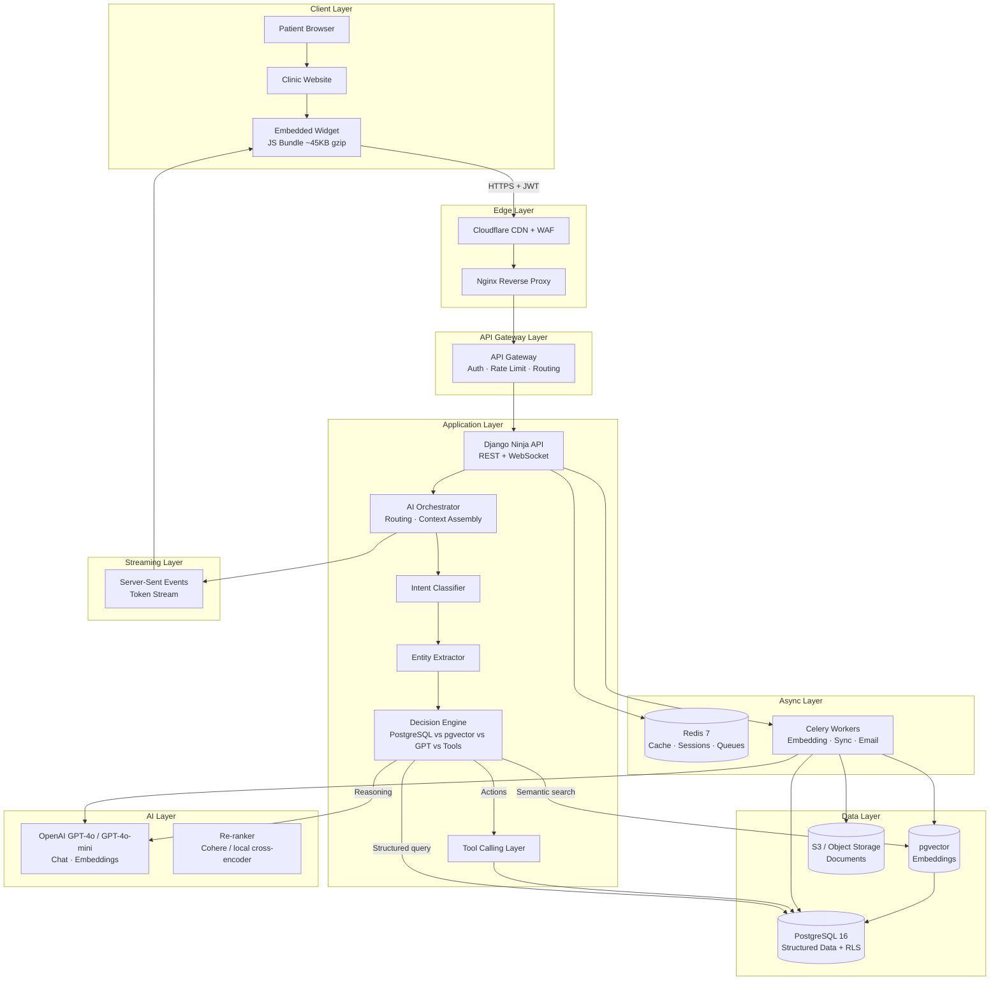

## 2.2 Request Lifecycle — Step-by-Step Detail

Every patient message traverses the following pipeline. Each step has defined inputs, outputs, latency budget, and failure behavior.

### Step 1: Patient

| Attribute | Detail |
|---|---|
| **Actor** | Patient on clinic website |
| **Action** | Types message or clicks quick-action chip (e.g., "Find a doctor") |
| **Data emitted** | `{ message, session_id, clinic_slug, locale, metadata }` |
| **Security** | Widget holds `clinic_public_key`; no PII in initial messages |

### Step 2: Clinic Website

| Attribute | Detail |
|---|---|
| **Role** | Host page for the embed |
| **Integration** | `<script src="https://cdn.synapse.health/widget.js" data-clinic="acme-clinic">` |
| **Responsibility** | Loads widget iframe/shadow DOM; passes `clinic_id` context |
| **CSP** | Clinic must allow `cdn.synapse.health` and `api.synapse.health` |

### Step 3: Embedded Widget

| Attribute | Detail |
|---|---|
| **Technology** | Vanilla JS / Preact (~45KB gzip), no framework dependency |
| **Responsibilities** | Session management, SSE consumer, OTP UI, accessibility (WCAG 2.1 AA) |
| **State** | `session_token` in `sessionStorage`; refresh via `/api/v1/session/refresh` |
| **Offline** | Graceful degradation — shows "Chat temporarily unavailable" |
| **Communication** | `POST /api/v1/chat` (initiate), `GET /api/v1/chat/stream` (SSE) |

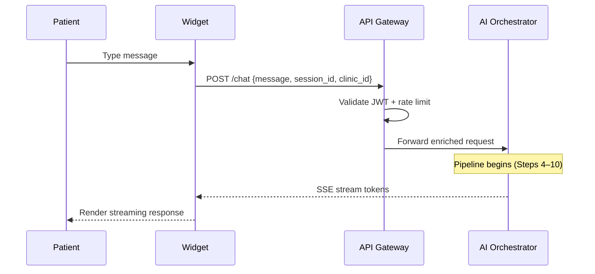

### Step 4: API Gateway

| Attribute | Detail |
|---|---|
| **Technology** | Nginx + Django middleware (or Kong at scale) |
| **Functions** | TLS termination, JWT validation, rate limiting, request ID injection, CORS |
| **Rate limits** | 30 req/min per session (chat), 10 req/min (booking), 5 req/min (OTP) |
| **Auth** | `Authorization: Bearer <session_jwt>` — scoped to `clinic_id` + `session_id` |
| **Headers added** | `X-Request-ID`, `X-Clinic-ID`, `X-Latency-Budget-Remaining` |
| **Rejection codes** | 401 (invalid token), 429 (rate limit), 403 (clinic suspended) |

### Step 5: AI Orchestrator

The **AI Orchestrator** is the central nervous system. It does NOT call GPT immediately — it assembles context, selects a pipeline, and coordinates all subsystems.

| Responsibility | Detail |
|---|---|
| **Session hydration** | Load last N messages from `chat_messages`, patient auth state |
| **Clinic context** | Load clinic config, feature flags, business hours, timezone |
| **Pipeline selection** | Route to: FAQ RAG, structured query, booking flow, escalation, or general |
| **Context window budget** | Allocate tokens: system (800) + clinic (400) + RAG (2000) + history (1500) + user (remaining) |
| **Guardrails** | Pre-filter for PHI leakage, prompt injection patterns |
| **Output mode** | Streaming text, structured JSON (booking), or tool call |

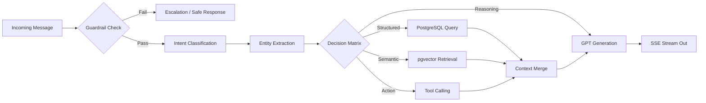

### Step 6: Decision Engine

The Decision Engine applies a **deterministic routing matrix** before any LLM call. This reduces cost and latency.

| Condition | Route | Example |
|---|---|---|
| Intent = `doctor_search` + entity `specialty` | **PostgreSQL** | "Find a cardiologist" → SQL on `doctors` + `specialties` |
| Intent = `availability` + entity `doctor_id` | **PostgreSQL + Tool** | Query `doctor_schedules` → call `check_availability` tool |
| Intent = `insurance` + entity `plan_name` | **PostgreSQL** | Lookup `clinic_insurance` join table |
| Intent = `faq` or `general_question` | **pgvector RAG** | Semantic search on `document_chunks` |
| Intent = `booking` + auth = false | **Tool → OTP flow** | Redirect to authentication pipeline |
| Intent = `booking` + auth = true | **Tool calling** | `get_slots` → `create_appointment` |
| Intent = `medical_advice` | **GPT + guardrail** | Respond with disclaimer; no diagnosis |
| Intent = `greeting` | **Template / GPT-mini** | Low-cost canned or lightweight response |
| Confidence < 0.6 on any intent | **GPT full reasoning** | Fallback to general LLM with RAG context |
| Prompt injection detected | **Block + audit** | Return safe response; log to `audit_logs` |

### Step 7: Intent Classification

| Attribute | Detail |
|---|---|
| **Approach** | Hybrid: rule-based fast path + GPT-4o-mini classifier |
| **Fast path** | Regex + keyword maps per clinic for top-20 intents (< 5ms) |
| **ML path** | Fine-tuned classifier or structured GPT call for ambiguous inputs |
| **Output** | `{ intent: "doctor_search", confidence: 0.92, sub_intent: "by_specialty" }` |
| **Intents** | `greeting`, `doctor_search`, `availability`, `booking`, `insurance`, `faq`, `services`, `hours`, `location`, `medical_question`, `escalation`, `feedback`, `unknown` |
| **Latency budget** | 15ms (fast path) / 120ms (ML path) |

### Step 8: Entity Extraction

| Attribute | Detail |
|---|---|
| **Approach** | spaCy-style rules + GPT structured output for complex entities |
| **Entities** | `doctor_name`, `specialty`, `date`, `time_preference`, `insurance_plan`, `service`, `location`, `symptom` (non-diagnostic) |
| **Output** | `{ specialty: "cardiology", date: "2026-07-15", time_preference: "morning" }` |
| **Normalization** | Map "heart doctor" → `cardiology` via clinic-specific synonym table in `clinic_config` JSONB |
| **Latency budget** | 20ms (rules) / 100ms (GPT structured) |

### Step 9: Tool Calling

| Tool | Trigger | Backend |
|---|---|---|
| `search_doctors` | doctor_search intent | PostgreSQL query |
| `check_availability` | availability intent | PostgreSQL + schedule logic |
| `get_insurance_info` | insurance intent | PostgreSQL join |
| `send_otp` | booking + unauthenticated | Celery → SMS/email provider |
| `verify_otp` | OTP submission | Redis (TTL 5 min) + PostgreSQL |
| `create_appointment` | booking + authenticated | PostgreSQL transaction |
| `search_documents` | faq / general | pgvector similarity |
| `escalate_to_human` | escalation intent | Create ticket + notify staff |
| `get_clinic_hours` | hours intent | PostgreSQL / config |

Tools return **structured JSON** fed back to GPT for natural language generation, or directly to the widget for UI rendering (slot picker).

### Step 10: PostgreSQL

| Attribute | Detail |
|---|---|
| **Role** | Source of truth for all structured clinic data |
| **Multi-tenancy** | Every table has `clinic_id`; Row-Level Security (RLS) enforced |
| **Query pattern** | Parameterized queries via Django ORM; no raw SQL from LLM |
| **Connection pooling** | PgBouncer — 1 pool per service, max 100 connections |
| **Latency budget** | 12ms (p95) for indexed lookups |

### Step 11: pgvector

| Attribute | Detail |
|---|---|
| **Role** | Semantic search over document chunks and FAQ embeddings |
| **Index** | HNSW index on `embedding vector(1536)` per clinic partition |
| **Query** | `SELECT ... ORDER BY embedding <=> $1 LIMIT 10` filtered by `clinic_id` |
| **Threshold** | Min cosine similarity 0.72; below → "I don't have that information" |
| **Latency budget** | 20ms (p95) with HNSW at 100K chunks per clinic |

### Step 12: GPT

| Attribute | Detail |
|---|---|
| **Models** | GPT-4o-mini (classification, simple responses), GPT-4o (complex reasoning, booking) |
| **Usage** | Intent fallback, response generation, structured output, tool selection |
| **Not used for** | Direct SQL generation, raw PHI processing without redaction |
| **Latency budget** | 900ms to first token (p95) |

### Step 13: Streaming

| Attribute | Detail |
|---|---|
| **Protocol** | Server-Sent Events (SSE) |
| **Format** | `data: {"type":"token","content":"Hello"}\n\n` |
| **Events** | `token`, `tool_call`, `ui_component`, `done`, `error` |
| **Throughput** | 40 tokens/sec target |
| **Client handling** | Widget buffers tokens, renders markdown, shows typing indicator |
| **Disconnect** | Server continues generation; client reconnects via `Last-Event-ID` |

## 2.3 AI Orchestrator — Routing Logic (Detailed)

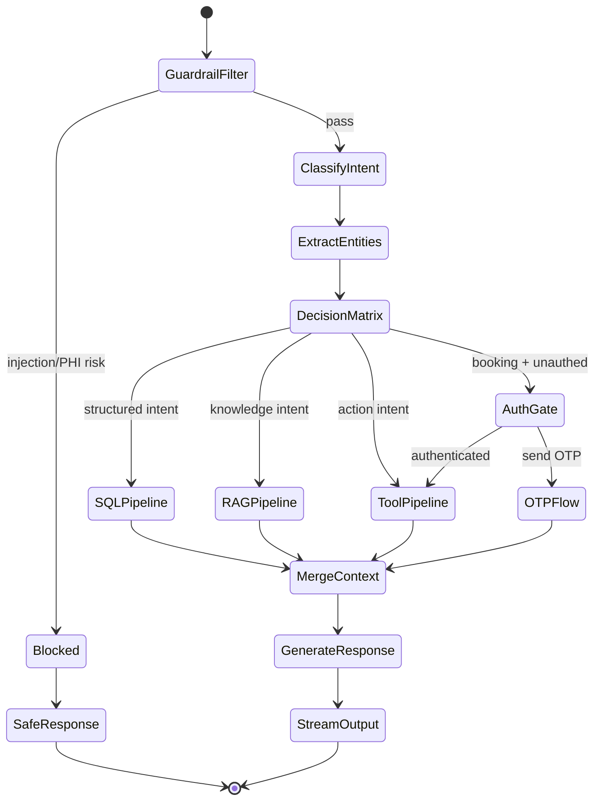

## 2.4 Decision Matrix — When to Use What

| Data Need | System | Why Not LLM? | Latency | Cost |
|---|---|---|---|---|
| Doctor by specialty | **PostgreSQL** | Exact match, always current | 12ms | $0 |
| Schedule / slots | **PostgreSQL** | Transactional accuracy | 15ms | $0 |
| Insurance accepted? | **PostgreSQL** | Boolean join, no hallucination | 10ms | $0 |
| "What is your cancellation policy?" | **pgvector RAG** | Lives in unstructured docs | 25ms | ~$0.001 embed query |
| "Summarize Dr. Smith's background" | **pgvector RAG** | Bio in PDF | 25ms | ~$0.001 |
| Complex multi-step booking | **Tool Calling + GPT** | Needs reasoning + action | 1200ms | ~$0.01 |
| Greeting / small talk | **Template / GPT-mini** | Low value, low cost | 50ms | ~$0.0001 |
| Medical symptom question | **GPT + guardrail** | Needs careful language | 900ms | ~$0.005 |
| Ambiguous query | **GPT-4o full** | Requires reasoning | 900ms | ~$0.008 |

---

# Part 4 — Technology Decision

## 4.1 Candidates Evaluated

| Stack | Description |
|---|---|
| **A: Rust (Actix/Axum)** | Full backend in Rust |
| **B: Django + Django Ninja** | Python monolith with modern API layer |
| **C: Rails only** | Ruby on Rails full stack |
| **D: Rails + FastAPI** | Rails for CRUD/admin, FastAPI for AI/streaming |
| **E: Node.js (NestJS)** | TypeScript backend |
| **F: Go (Fiber/Echo)** | Go microservices |

## 4.2 Comparison Matrix

| Criterion (weight) | Rust | Django + Ninja | Rails | Rails + FastAPI | Node | Go |
|---|---|---|---|---|---|---|
| **Time to MVP** (20%) | ⭐⭐ | ⭐⭐⭐⭐⭐ | ⭐⭐⭐⭐ | ⭐⭐⭐ | ⭐⭐⭐⭐ | ⭐⭐⭐ |
| **AI/ML ecosystem** (20%) | ⭐⭐ | ⭐⭐⭐⭐⭐ | ⭐⭐ | ⭐⭐⭐⭐ | ⭐⭐⭐ | ⭐⭐ |
| **Multi-tenant patterns** (15%) | ⭐⭐⭐ | ⭐⭐⭐⭐⭐ | ⭐⭐⭐⭐ | ⭐⭐⭐⭐ | ⭐⭐⭐ | ⭐⭐⭐ |
| **Async / streaming** (15%) | ⭐⭐⭐⭐⭐ | ⭐⭐⭐⭐ | ⭐⭐⭐ | ⭐⭐⭐⭐⭐ | ⭐⭐⭐⭐ | ⭐⭐⭐⭐⭐ |
| **ORM / admin / CRUD** (10%) | ⭐⭐ | ⭐⭐⭐⭐⭐ | ⭐⭐⭐⭐⭐ | ⭐⭐⭐⭐ | ⭐⭐⭐ | ⭐⭐ |
| **Hiring pool** (10%) | ⭐⭐ | ⭐⭐⭐⭐⭐ | ⭐⭐⭐ | ⭐⭐⭐ | ⭐⭐⭐⭐⭐ | ⭐⭐⭐ |
| **Operational maturity** (10%) | ⭐⭐⭐ | ⭐⭐⭐⭐⭐ | ⭐⭐⭐⭐ | ⭐⭐⭐ | ⭐⭐⭐⭐ | ⭐⭐⭐⭐ |
| **Weighted score** | **2.8** | **4.6** | **3.5** | **3.9** | **3.6** | **3.2** |

## 4.3 Detailed Trade-off Analysis

### Rust
- **Pros:** Maximum performance, memory safety, excellent for gateway services
- **Cons:** Slowest MVP velocity; immature AI library ecosystem; no built-in admin; team ramp-up cost
- **Verdict:** ❌ Over-engineered for MVP. Consider for dedicated high-throughput gateway at 10K+ clinic scale.

### Django + Django Ninja ✅ RECOMMENDED
- **Pros:** Batteries-included (auth, admin, ORM, migrations); Django Ninja adds async, OpenAPI, type hints; Celery integration is battle-tested; Python dominates AI/ML tooling; `django-tenants` or RLS patterns well-documented; largest hiring pool for AI+web
- **Cons:** GIL limits CPU-bound concurrency (mitigated by async views + Celery workers); slightly heavier than FastAPI alone
- **Verdict:** ✅ **Best balance of velocity, ecosystem, and scale.**

### Rails Only
- **Pros:** Rapid CRUD, excellent conventions, good admin (ActiveAdmin)
- **Cons:** Weaker AI/ML ecosystem; fewer pgvector/Celery patterns in production; harder to find AI+Rails engineers
- **Verdict:** ❌ Viable but ecosystem mismatch for AI-heavy platform.

### Rails + FastAPI
- **Pros:** Best-of-breed for CRUD (Rails) and streaming (FastAPI)
- **Cons:** Two runtimes, two ORMs, doubled operational complexity, distributed transaction challenges
- **Verdict:** ❌ Premature split. Adds complexity without MVP benefit.

### Node.js (NestJS)
- **Pros:** Same language as widget; good real-time
- **Cons:** Weaker ORM/ML ecosystem; type safety friction; less mature HIPAA tooling
- **Verdict:** ❌ Widget stays vanilla JS; no need for full-stack JS.

### Go
- **Pros:** Excellent concurrency, simple deployment
- **Cons:** No admin panel, weak AI ecosystem, verbose CRUD
- **Verdict:** ❌ Good for future gateway extraction, not primary app.

## 4.4 Final Technology Selection

| Layer | Technology | Reason |
|---|---|---|
| **API Framework** | Django 5 + Django Ninja | Type-safe async API, OpenAPI auto-gen, Python AI ecosystem |
| **Admin Panel** | Django Admin (customized) | Clinic management, document upload, analytics — zero build time |
| **Database** | PostgreSQL 16 + pgvector | Single DB for structured + vector; RLS for multi-tenancy |
| **Cache / Queue** | Redis 7 | Sessions, rate limits, Celery broker, SSE pub/sub |
| **Task Queue** | Celery 5 + Celery Beat | Document embedding, sync, email, retries, DLQ |
| **AI Models** | OpenAI GPT-4o / GPT-4o-mini | Best tool-calling, structured output, streaming |
| **Embeddings** | text-embedding-3-small (1536d) | Cost-efficient, sufficient quality for clinic docs |
| **Re-ranker** | Cohere Rerank v3 (or local cross-encoder at scale) | Improves RAG precision |
| **Object Storage** | AWS S3 (or Cloudflare R2) | Document storage, widget CDN |
| **CDN / WAF** | Cloudflare | DDoS protection, edge caching for widget |
| **Web Server** | Nginx + Gunicorn (sync) / Uvicorn (async) | Reverse proxy, TLS, load balancing |
| **Containerization** | Docker + Docker Compose (dev) / ECS or Railway (prod) | Reproducible environments |
| **CI/CD** | GitHub Actions | Test, lint, build, deploy pipeline |
| **Monitoring** | Prometheus + Grafana + Sentry + OpenTelemetry | Metrics, errors, tracing |
| **Widget** | Vanilla JS / Preact | Minimal footprint, no framework lock-in for clinics |

---

# Part 5 — AI Architecture

## 5.1 AI Pipeline Overview

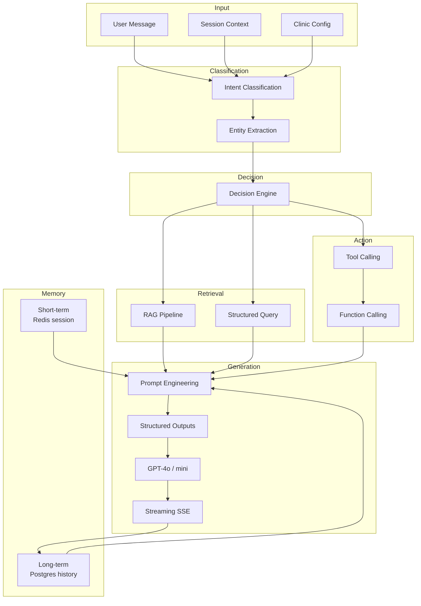

## 5.2 Component Deep Dive

### Intent Classification

| Aspect | Detail |
|---|---|
| **Tier 1 — Rules** | Keyword maps, regex, clinic-specific quick intents. Zero API cost. Handles ~60% of traffic. |
| **Tier 2 — Lightweight ML** | GPT-4o-mini with structured output schema: `{intent, confidence, sub_intent}`. Handles ambiguous inputs. |
| **Tier 3 — Contextual** | When previous turn was `booking`, bias classifier toward booking sub-intents (slot selection, confirm). |
| **Training data** | Logged conversations → monthly review → update keyword maps and few-shot examples. |
| **Fallback** | `unknown` intent → full RAG + GPT pipeline. |

### Entity Extraction

| Entity Type | Extraction Method | Example |
|---|---|---|
| `specialty` | Synonym table + NER | "heart doctor" → `cardiology` |
| `doctor_name` | Fuzzy match against `doctors` table | "Dr. Smth" → `Dr. John Smith` |
| `date` | dateparser library | "next Tuesday" → `2026-07-14` |
| `time_preference` | Rule-based | "morning" → `09:00-12:00` |
| `insurance_plan` | Fuzzy match against `insurance_plans` | "Blue Cross" → `BCBS PPO` |
| `service` | Match against `services` table | "annual physical" → `service_id: 42` |

### Decision Engine

Already detailed in Part 2 §2.4. Key principle: **deterministic first, probabilistic last.**

### RAG (Retrieval-Augmented Generation)

See Part 9 for full pipeline. Summary: chunk → embed → store → retrieve → re-rank → inject into prompt.

### Tool Calling

GPT receives tool definitions as JSON Schema. Orchestrator executes tools server-side (never client-side). Results fed back for NL generation.

```json
{
  "tools": [
    {
      "name": "search_doctors",
      "description": "Search doctors by specialty, name, or availability",
      "parameters": {
        "specialty": "string?",
        "name": "string?",
        "clinic_id": "uuid (injected server-side)"
      }
    }
  ]
}
```

### Streaming

- SSE connection per chat turn
- Events: `token`, `tool_start`, `tool_result`, `ui_block` (slot picker, doctor cards), `done`, `error`
- Backpressure: if client slow, buffer max 500 tokens then pause generation

### Memory

| Type | Storage | TTL | Contents |
|---|---|---|---|
| **Short-term** | Redis | 30 min idle / 24h max | Current flow state, OTP codes, pending booking |
| **Working** | Postgres `chat_messages` | Session lifetime | Last 20 messages for context window |
| **Long-term** | Postgres `chat_sessions` | 90 days (configurable) | Session metadata, satisfaction score |
| **Episodic** | Not in MVP | — | Future: patient preference memory post-auth |

### Prompt Engineering

**System prompt template (per clinic):**

```
You are a helpful assistant for {clinic_name}. You help patients with:
- Finding doctors and checking availability
- Understanding services and insurance
- Booking appointments (authenticated patients only)
- Answering questions about the clinic

RULES:
- Never provide medical diagnoses or treatment advice
- Always recommend calling 911 for emergencies
- Only use information from provided context
- If unsure, say "I don't have that information" and offer to connect with staff
- Respond in {locale}

CONTEXT:
{retrieved_chunks}

CLINIC DATA:
{structured_query_results}
```

### Structured Outputs

Used for: intent classification, entity extraction, booking confirmation, escalation tickets.

```json
{
  "type": "object",
  "properties": {
    "intent": { "type": "string", "enum": ["doctor_search", "booking", "..."] },
    "confidence": { "type": "number" },
    "entities": { "type": "object" },
    "requires_auth": { "type": "boolean" }
  }
}
```

### Function Calling

Function calling is the GPT API mechanism; tools are our server-side implementations. Flow:

1. GPT returns `tool_calls[]` with function name + arguments
2. Orchestrator validates arguments against schema
3. Executes against PostgreSQL / external APIs
4. Returns `tool_results` to GPT for final response generation

---

# Part 6 — Complete Database Design

## 6.1 Entity-Relationship Diagram

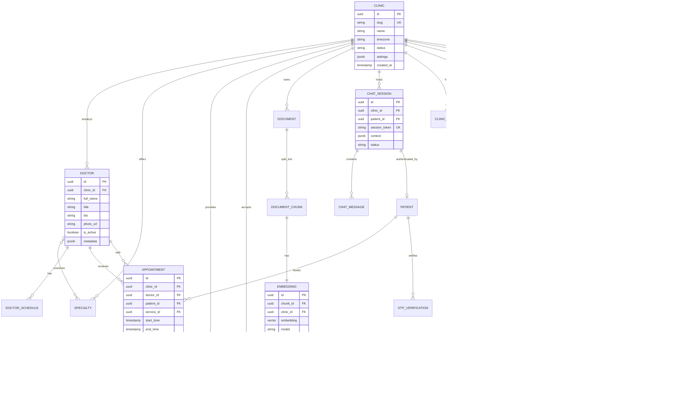

## 6.2 Table Definitions

### `clinics`

| Column | Type | Constraints | Description |
|---|---|---|---|
| `id` | `UUID` | PK, DEFAULT gen_random_uuid() | Primary key |
| `slug` | `VARCHAR(64)` | UNIQUE, NOT NULL | URL-safe identifier (e.g., `acme-cardiology`) |
| `name` | `VARCHAR(255)` | NOT NULL | Display name |
| `email` | `VARCHAR(255)` | NOT NULL | Admin contact |
| `phone` | `VARCHAR(20)` | | Main phone |
| `address` | `JSONB` | | `{street, city, state, zip, country}` |
| `timezone` | `VARCHAR(50)` | NOT NULL, DEFAULT 'America/New_York' | IANA timezone |
| `status` | `VARCHAR(20)` | NOT NULL, DEFAULT 'active' | `active`, `suspended`, `onboarding` |
| `subscription_tier` | `VARCHAR(20)` | DEFAULT 'starter' | `starter`, `professional`, `enterprise` |
| `settings` | `JSONB` | DEFAULT '{}' | Widget theme, feature flags, business hours |
| `created_at` | `TIMESTAMPTZ` | NOT NULL, DEFAULT now() | |
| `updated_at` | `TIMESTAMPTZ` | NOT NULL, DEFAULT now() | |

**Indexes:** `UNIQUE(slug)`, `INDEX(status)`

---

### `clinic_configs`

| Column | Type | Constraints | Description |
|---|---|---|---|
| `id` | `UUID` | PK | |
| `clinic_id` | `UUID` | FK → clinics, UNIQUE | One config per clinic |
| `widget_config` | `JSONB` | | `{primary_color, position, greeting, logo_url}` |
| `ai_config` | `JSONB` | | `{model, temperature, max_tokens, system_prompt_override}` |
| `booking_config` | `JSONB` | | `{require_auth, otp_method, slot_duration_min, buffer_min}` |
| `synonym_map` | `JSONB` | | `{"heart doctor": "cardiology"}` |
| `feature_flags` | `JSONB` | | `{booking: true, insurance: true, rag: true}` |

---

### `doctors`

| Column | Type | Constraints | Description |
|---|---|---|---|
| `id` | `UUID` | PK | |
| `clinic_id` | `UUID` | FK → clinics, NOT NULL | Tenant isolation |
| `external_id` | `VARCHAR(100)` | | ID from clinic's EHR/PM system |
| `full_name` | `VARCHAR(255)` | NOT NULL | |
| `title` | `VARCHAR(50)` | | `MD`, `DO`, `NP`, `PA` |
| `bio` | `TEXT` | | Professional biography |
| `photo_url` | `VARCHAR(500)` | | S3 URL |
| `languages` | `VARCHAR[]` | DEFAULT '{en}' | Spoken languages |
| `is_active` | `BOOLEAN` | DEFAULT true | |
| `is_accepting_patients` | `BOOLEAN` | DEFAULT true | |
| `metadata` | `JSONB` | DEFAULT '{}' | Education, certifications, etc. |
| `created_at` | `TIMESTAMPTZ` | NOT NULL | |
| `updated_at` | `TIMESTAMPTZ` | NOT NULL | |

**Indexes:** `INDEX(clinic_id, is_active)`, `INDEX(clinic_id, external_id)`, `GIN(metadata)`

---

### `specialties`

| Column | Type | Constraints | Description |
|---|---|---|---|
| `id` | `UUID` | PK | |
| `clinic_id` | `UUID` | FK → clinics | |
| `name` | `VARCHAR(100)` | NOT NULL | `Cardiology`, `Dermatology` |
| `slug` | `VARCHAR(100)` | NOT NULL | |
| `description` | `TEXT` | | |

**Indexes:** `UNIQUE(clinic_id, slug)`

---

### `doctor_specialties` (M2M)

| Column | Type | Constraints |
|---|---|---|
| `doctor_id` | `UUID` | FK → doctors, PK |
| `specialty_id` | `UUID` | FK → specialties, PK |

---

### `doctor_schedules`

| Column | Type | Constraints | Description |
|---|---|---|---|
| `id` | `UUID` | PK | |
| `clinic_id` | `UUID` | FK → clinics | |
| `doctor_id` | `UUID` | FK → doctors | |
| `day_of_week` | `SMALLINT` | 0-6 | 0=Monday |
| `start_time` | `TIME` | NOT NULL | |
| `end_time` | `TIME` | NOT NULL | |
| `slot_duration_min` | `SMALLINT` | DEFAULT 30 | |
| `is_active` | `BOOLEAN` | DEFAULT true | |

**Indexes:** `INDEX(clinic_id, doctor_id, day_of_week)`

---

### `services`

| Column | Type | Constraints | Description |
|---|---|---|---|
| `id` | `UUID` | PK | |
| `clinic_id` | `UUID` | FK → clinics | |
| `name` | `VARCHAR(255)` | NOT NULL | |
| `description` | `TEXT` | | |
| `duration_min` | `SMALLINT` | DEFAULT 30 | |
| `price_cents` | `INTEGER` | | Optional |
| `is_active` | `BOOLEAN` | DEFAULT true | |

---

### `insurance_plans`

| Column | Type | Constraints | Description |
|---|---|---|---|
| `id` | `UUID` | PK | |
| `clinic_id` | `UUID` | FK → clinics | |
| `provider_name` | `VARCHAR(255)` | NOT NULL | `Blue Cross Blue Shield` |
| `plan_name` | `VARCHAR(255)` | | `PPO Gold` |
| `plan_type` | `VARCHAR(50)` | | `PPO`, `HMO`, `Medicare` |
| `is_accepted` | `BOOLEAN` | DEFAULT true | |
| `notes` | `TEXT` | | Copay info, referral requirements |
| `metadata` | `JSONB` | | |

**Indexes:** `INDEX(clinic_id, is_accepted)`, `GIN(to_tsvector('english', provider_name || ' ' || plan_name))`

---

### `patients`

| Column | Type | Constraints | Description |
|---|---|---|---|
| `id` | `UUID` | PK | |
| `clinic_id` | `UUID` | FK → clinics | Scoped per clinic |
| `phone` | `VARCHAR(20)` | | E.164 format |
| `email` | `VARCHAR(255)` | | |
| `full_name` | `VARCHAR(255)` | | |
| `date_of_birth` | `DATE` | | Encrypted at rest |
| `external_id` | `VARCHAR(100)` | | EHR patient ID |
| `metadata` | `JSONB` | | |
| `created_at` | `TIMESTAMPTZ` | NOT NULL | |

**Indexes:** `UNIQUE(clinic_id, phone)`, `UNIQUE(clinic_id, email)`, `INDEX(clinic_id, external_id)`

---

### `appointments`

| Column | Type | Constraints | Description |
|---|---|---|---|
| `id` | `UUID` | PK | |
| `clinic_id` | `UUID` | FK → clinics | |
| `doctor_id` | `UUID` | FK → doctors | |
| `patient_id` | `UUID` | FK → patients | |
| `service_id` | `UUID` | FK → services, NULL | |
| `insurance_plan_id` | `UUID` | FK → insurance_plans, NULL | |
| `start_time` | `TIMESTAMPTZ` | NOT NULL | |
| `end_time` | `TIMESTAMPTZ` | NOT NULL | |
| `status` | `VARCHAR(20)` | NOT NULL | `pending`, `confirmed`, `cancelled`, `completed`, `no_show` |
| `confirmation_code` | `VARCHAR(10)` | UNIQUE | Human-readable code |
| `notes` | `TEXT` | | Patient-provided notes |
| `source` | `VARCHAR(20)` | DEFAULT 'chatbot' | `chatbot`, `sync`, `manual` |
| `created_at` | `TIMESTAMPTZ` | NOT NULL | |

**Indexes:** `INDEX(clinic_id, doctor_id, start_time)`, `INDEX(clinic_id, patient_id)`, `INDEX(clinic_id, status, start_time)`, `EXCLUDE USING gist (doctor_id WITH =, tstzrange(start_time, end_time) WITH &&) WHERE (status NOT IN ('cancelled'))` — prevents double-booking

---

### `documents`

| Column | Type | Constraints | Description |
|---|---|---|---|
| `id` | `UUID` | PK | |
| `clinic_id` | `UUID` | FK → clinics | |
| `title` | `VARCHAR(255)` | NOT NULL | |
| `file_name` | `VARCHAR(255)` | | Original filename |
| `file_type` | `VARCHAR(50)` | | `pdf`, `docx`, `txt`, `html` |
| `s3_key` | `VARCHAR(500)` | NOT NULL | Object storage path |
| `file_size_bytes` | `INTEGER` | | |
| `status` | `VARCHAR(20)` | DEFAULT 'pending' | `pending`, `processing`, `indexed`, `failed` |
| `chunk_count` | `INTEGER` | DEFAULT 0 | |
| `metadata` | `JSONB` | | `{author, category, page_count}` |
| `created_at` | `TIMESTAMPTZ` | NOT NULL | |

**Indexes:** `INDEX(clinic_id, status)`

---

### `document_chunks`

| Column | Type | Constraints | Description |
|---|---|---|---|
| `id` | `UUID` | PK | |
| `clinic_id` | `UUID` | FK → clinics | |
| `document_id` | `UUID` | FK → documents | |
| `chunk_index` | `INTEGER` | NOT NULL | Order within document |
| `content` | `TEXT` | NOT NULL | Chunk text |
| `token_count` | `INTEGER` | | |
| `metadata` | `JSONB` | | `{page, section, heading}` |

**Indexes:** `INDEX(clinic_id, document_id)`, `GIN(to_tsvector('english', content))` — hybrid search

---

### `embeddings`

| Column | Type | Constraints | Description |
|---|---|---|---|
| `id` | `UUID` | PK | |
| `clinic_id` | `UUID` | FK → clinics | |
| `chunk_id` | `UUID` | FK → document_chunks, UNIQUE | One embedding per chunk |
| `embedding` | `vector(1536)` | NOT NULL | pgvector column |
| `model` | `VARCHAR(50)` | DEFAULT 'text-embedding-3-small' | |
| `created_at` | `TIMESTAMPTZ` | NOT NULL | |

**Indexes:** `CREATE INDEX ON embeddings USING hnsw (embedding vector_cosine_ops) WITH (m=16, ef_construction=64)` — per clinic partition at scale

---

### `chat_sessions`

| Column | Type | Constraints | Description |
|---|---|---|---|
| `id` | `UUID` | PK | |
| `clinic_id` | `UUID` | FK → clinics | |
| `patient_id` | `UUID` | FK → patients, NULL | Set after auth |
| `session_token` | `VARCHAR(64)` | UNIQUE | Widget session identifier |
| `ip_hash` | `VARCHAR(64)` | | SHA-256 of IP (not raw IP) |
| `user_agent` | `VARCHAR(500)` | | |
| `locale` | `VARCHAR(10)` | DEFAULT 'en' | |
| `context` | `JSONB` | DEFAULT '{}' | Flow state: `{current_intent, booking_state}` |
| `is_authenticated` | `BOOLEAN` | DEFAULT false | |
| `status` | `VARCHAR(20)` | DEFAULT 'active' | `active`, `closed`, `escalated` |
| `satisfaction_score` | `SMALLINT` | | 1-5 rating |
| `created_at` | `TIMESTAMPTZ` | NOT NULL | |
| `last_active_at` | `TIMESTAMPTZ` | NOT NULL | |

**Indexes:** `INDEX(clinic_id, status)`, `INDEX(session_token)`, `INDEX(clinic_id, last_active_at)`

---

### `chat_messages`

| Column | Type | Constraints | Description |
|---|---|---|---|
| `id` | `UUID` | PK | |
| `clinic_id` | `UUID` | FK → clinics | |
| `session_id` | `UUID` | FK → chat_sessions | |
| `role` | `VARCHAR(20)` | NOT NULL | `user`, `assistant`, `system`, `tool` |
| `content` | `TEXT` | NOT NULL | |
| `metadata` | `JSONB` | DEFAULT '{}' | `{intent, entities, tool_calls, latency_ms, model}` |
| `token_count` | `INTEGER` | | |
| `created_at` | `TIMESTAMPTZ` | NOT NULL | |

**Indexes:** `INDEX(session_id, created_at)`, `INDEX(clinic_id, created_at)`

---

### `otp_verifications`

| Column | Type | Constraints | Description |
|---|---|---|---|
| `id` | `UUID` | PK | |
| `clinic_id` | `UUID` | FK → clinics | |
| `session_id` | `UUID` | FK → chat_sessions | |
| `phone` | `VARCHAR(20)` | NOT NULL | |
| `code_hash` | `VARCHAR(64)` | NOT NULL | bcrypt hash of OTP |
| `attempts` | `SMALLINT` | DEFAULT 0 | |
| `max_attempts` | `SMALLINT` | DEFAULT 3 | |
| `expires_at` | `TIMESTAMPTZ` | NOT NULL | 5 min TTL |
| `verified_at` | `TIMESTAMPTZ` | NULL | |

**Indexes:** `INDEX(session_id)`, `INDEX(clinic_id, phone, expires_at)`

---

### `email_logs`

| Column | Type | Constraints | Description |
|---|---|---|---|
| `id` | `UUID` | PK | |
| `clinic_id` | `UUID` | FK → clinics | |
| `patient_id` | `UUID` | FK → patients, NULL | |
| `appointment_id` | `UUID` | FK → appointments, NULL | |
| `to_email` | `VARCHAR(255)` | NOT NULL | |
| `template` | `VARCHAR(50)` | | `appointment_confirm`, `otp`, `escalation` |
| `subject` | `VARCHAR(255)` | | |
| `status` | `VARCHAR(20)` | | `queued`, `sent`, `failed`, `bounced` |
| `provider_id` | `VARCHAR(100)` | | SendGrid/SES message ID |
| `metadata` | `JSONB` | | |
| `created_at` | `TIMESTAMPTZ` | NOT NULL | |

**Indexes:** `INDEX(clinic_id, created_at)`, `INDEX(status)`

---

### `audit_logs`

| Column | Type | Constraints | Description |
|---|---|---|---|
| `id` | `UUID` | PK | |
| `clinic_id` | `UUID` | FK → clinics | |
| `actor_type` | `VARCHAR(20)` | | `patient`, `admin`, `system` |
| `actor_id` | `UUID` | | |
| `action` | `VARCHAR(50)` | NOT NULL | `chat.message`, `booking.create`, `auth.otp`, `data.sync` |
| `resource_type` | `VARCHAR(50)` | | |
| `resource_id` | `UUID` | | |
| `ip_hash` | `VARCHAR(64)` | | |
| `details` | `JSONB` | | Request metadata (no raw PHI) |
| `created_at` | `TIMESTAMPTZ` | NOT NULL | |

**Indexes:** `INDEX(clinic_id, created_at)`, `INDEX(action, created_at)` — partitioned monthly at scale

---

### `analytics_events`

| Column | Type | Constraints | Description |
|---|---|---|---|
| `id` | `UUID` | PK | |
| `clinic_id` | `UUID` | FK → clinics | |
| `session_id` | `UUID` | FK → chat_sessions, NULL | |
| `event_type` | `VARCHAR(50)` | NOT NULL | `chat.started`, `intent.classified`, `booking.completed` |
| `properties` | `JSONB` | DEFAULT '{}' | `{intent, latency_ms, model, tokens}` |
| `created_at` | `TIMESTAMPTZ` | NOT NULL | |

**Indexes:** `INDEX(clinic_id, event_type, created_at)` — partitioned weekly at scale

---

### `sync_logs`

| Column | Type | Constraints | Description |
|---|---|---|---|
| `id` | `UUID` | PK | |
| `clinic_id` | `UUID` | FK → clinics | |
| `sync_type` | `VARCHAR(50)` | | `doctors`, `schedules`, `insurance`, `full` |
| `source` | `VARCHAR(50)` | | `api`, `csv`, `ehr_webhook` |
| `status` | `VARCHAR(20)` | | `running`, `completed`, `failed` |
| `records_created` | `INTEGER` | DEFAULT 0 | |
| `records_updated` | `INTEGER` | DEFAULT 0 | |
| `records_failed` | `INTEGER` | DEFAULT 0 | |
| `error_details` | `JSONB` | | |
| `started_at` | `TIMESTAMPTZ` | NOT NULL | |
| `completed_at` | `TIMESTAMPTZ` | | |

---

## 6.3 Normalization

- **3NF** for all structured tables — no repeating groups, no transitive dependencies
- **JSONB** used deliberately for: `settings`, `metadata`, `widget_config`, `context` — data that is clinic-specific, schema-flexible, and rarely queried relationally
- **Denormalization:** `clinic_id` duplicated on all child tables to enable RLS without joins
- **Partitioning:** `audit_logs` and `analytics_events` partitioned by time at 1,000+ clinic scale

## 6.4 Row-Level Security (RLS)

```sql
-- Applied to every tenant-scoped table
ALTER TABLE doctors ENABLE ROW LEVEL SECURITY;

CREATE POLICY clinic_isolation ON doctors
    USING (clinic_id = current_setting('app.current_clinic_id')::uuid);

-- Set per request in Django middleware:
-- SET LOCAL app.current_clinic_id = '<clinic_uuid>';
```

## 6.5 JSONB Usage Summary

| Table | Column | Purpose | Query Pattern |
|---|---|---|---|
| `clinics` | `settings` | Business hours, branding | Read on session init |
| `clinics` | `address` | Structured address | Display only |
| `clinic_configs` | `synonym_map` | Intent entity normalization | Read per classification |
| `clinic_configs` | `feature_flags` | Toggle features per clinic | Read per request |
| `doctors` | `metadata` | Education, certifications | Display / JSONB @> query |
| `chat_sessions` | `context` | Booking flow state machine | Read/write per turn |
| `chat_messages` | `metadata` | Intent, latency, tool calls | Analytics aggregation |
| `audit_logs` | `details` | Event-specific data | Write-only audit trail |

---

# Part 7 — API Design

**Base URL:** `https://api.synapse.health/api/v1`  
**Auth:** JWT Bearer tokens (session-scoped)  
**Content-Type:** `application/json`  
**Versioning:** URL prefix `/v1`

## 7.1 Authentication Model

| Token Type | Scope | TTL | Issued By |
|---|---|---|---|
| `widget_session` | Chat, FAQ, doctor search | 24h | `POST /session` |
| `patient_auth` | Booking, history, profile | 2h (refreshable) | `POST /login` |
| `clinic_admin` | Sync, documents, config | 8h | Django admin / API key |
| `service_key` | Sync webhooks, internal | No expiry (rotated) | Platform ops |

---

### `POST /session` — Initialize Widget Session

| Field | Value |
|---|---|
| **Auth** | Public (clinic slug + origin validation) |
| **Rate Limit** | 10/min per IP |

**Request:**
```json
{
  "clinic_slug": "acme-cardiology",
  "locale": "en",
  "referrer_url": "https://acme-clinic.com/appointments"
}
```

**Response (201):**
```json
{
  "session_id": "uuid",
  "session_token": "eyJ...",
  "expires_at": "2026-07-09T15:00:00Z",
  "clinic": {
    "name": "Acme Cardiology",
    "widget_config": { "primary_color": "#2563EB", "greeting": "Hi! How can I help?" }
  }
}
```

**Validation:** `clinic_slug` required, must match active clinic; `referrer_url` checked against allowed origins.  
**Errors:** `404` clinic not found, `403` clinic suspended, `429` rate limited.

---

### `POST /chat` — Send Chat Message

| Field | Value |
|---|---|
| **Auth** | `widget_session` JWT |
| **Rate Limit** | 30/min per session |

**Request:**
```json
{
  "message": "I need to find a cardiologist",
  "session_id": "uuid"
}
```

**Response (200):**
```json
{
  "message_id": "uuid",
  "stream_url": "/api/v1/chat/stream?message_id=uuid"
}
```

**Streaming (`GET /chat/stream`):** SSE events as described in Part 5.

**Errors:** `401` invalid session, `400` empty message / >2000 chars, `429` rate limited.

---

### `GET /doctors` — Search Doctors

| Field | Value |
|---|---|
| **Auth** | `widget_session` JWT |
| **Rate Limit** | 60/min per session |

**Query Params:** `specialty`, `name`, `language`, `accepting_patients`, `page`, `page_size`

**Response (200):**
```json
{
  "results": [
    {
      "id": "uuid",
      "full_name": "Dr. Jane Smith",
      "title": "MD",
      "specialties": ["Cardiology"],
      "photo_url": "https://...",
      "is_accepting_patients": true,
      "next_available": "2026-07-10T09:00:00Z"
    }
  ],
  "total": 3,
  "page": 1
}
```

---

### `GET /availability` — Check Doctor Availability

| Field | Value |
|---|---|
| **Auth** | `widget_session` JWT |
| **Rate Limit** | 30/min per session |

**Query Params:** `doctor_id` (required), `date_from`, `date_to`, `service_id`

**Response (200):**
```json
{
  "doctor_id": "uuid",
  "slots": [
    { "start_time": "2026-07-10T09:00:00Z", "end_time": "2026-07-10T09:30:00Z", "available": true },
    { "start_time": "2026-07-10T09:30:00Z", "end_time": "2026-07-10T10:00:00Z", "available": false }
  ]
}
```

**Errors:** `404` doctor not found, `400` invalid date range (>30 days).

---

### `POST /otp` — Send OTP for Authentication

| Field | Value |
|---|---|
| **Auth** | `widget_session` JWT |
| **Rate Limit** | 5/min per session, 10/hour per phone |

**Request:**
```json
{
  "phone": "+15551234567",
  "method": "sms"
}
```

**Response (200):**
```json
{
  "otp_id": "uuid",
  "expires_at": "2026-07-08T15:10:00Z",
  "method": "sms",
  "masked_phone": "+1***4567"
}
```

**Errors:** `429` too many attempts, `400` invalid phone format.

---

### `POST /login` — Verify OTP / Authenticate Patient

| Field | Value |
|---|---|
| **Auth** | `widget_session` JWT |
| **Rate Limit** | 10/min per session |

**Request:**
```json
{
  "otp_id": "uuid",
  "code": "482910",
  "full_name": "John Doe",
  "date_of_birth": "1990-05-15"
}
```

**Response (200):**
```json
{
  "patient_id": "uuid",
  "auth_token": "eyJ...",
  "expires_at": "2026-07-08T17:00:00Z",
  "patient": { "full_name": "John Doe", "phone": "+15551234567" }
}
```

**Errors:** `401` invalid/expired OTP, `403` max attempts exceeded.

---

### `POST /booking` — Create Appointment

| Field | Value |
|---|---|
| **Auth** | `patient_auth` JWT (required) |
| **Rate Limit** | 10/min per patient |

**Request:**
```json
{
  "doctor_id": "uuid",
  "service_id": "uuid",
  "start_time": "2026-07-10T09:00:00Z",
  "insurance_plan_id": "uuid",
  "notes": "First visit for chest pain"
}
```

**Response (201):**
```json
{
  "appointment_id": "uuid",
  "confirmation_code": "ACME-7X2K",
  "status": "confirmed",
  "doctor": { "full_name": "Dr. Jane Smith" },
  "start_time": "2026-07-10T09:00:00Z",
  "end_time": "2026-07-10T09:30:00Z"
}
```

**Errors:** `409` slot no longer available, `401` not authenticated, `400` validation failure.

---

### `GET /history` — Chat & Appointment History

| Field | Value |
|---|---|
| **Auth** | `patient_auth` JWT |
| **Rate Limit** | 30/min |

**Response (200):**
```json
{
  "sessions": [{ "id": "uuid", "created_at": "...", "message_count": 12 }],
  "appointments": [{ "id": "uuid", "confirmation_code": "ACME-7X2K", "status": "confirmed" }]
}
```

---

### `POST /documents` — Upload Document (Admin)

| Field | Value |
|---|---|
| **Auth** | `clinic_admin` JWT |
| **Rate Limit** | 20/hour per clinic |

**Request:** `multipart/form-data` — `file`, `title`, `category`

**Response (202):**
```json
{
  "document_id": "uuid",
  "status": "processing",
  "estimated_chunks": 45
}
```

---

### `POST /sync` — Trigger Data Sync (Admin / Integration)

| Field | Value |
|---|---|
| **Auth** | `service_key` or `clinic_admin` |
| **Rate Limit** | 10/hour per clinic |

**Request:**
```json
{
  "sync_type": "full",
  "source": "api",
  "data": {
    "doctors": [...],
    "schedules": [...],
    "insurance": [...]
  }
}
```

**Response (202):**
```json
{
  "sync_id": "uuid",
  "status": "running"
}
```

---

### `POST /emails` — Send Templated Email (Internal)

| Field | Value |
|---|---|
| **Auth** | Internal service key |
| **Rate Limit** | 100/hour per clinic |

**Request:**
```json
{
  "template": "appointment_confirm",
  "to_email": "patient@example.com",
  "variables": { "confirmation_code": "ACME-7X2K", "doctor_name": "Dr. Smith" }
}
```

---

### `GET /insurance` — List Accepted Insurance

**Query Params:** `provider_name`, `plan_type`  
**Auth:** `widget_session` JWT

---

### `GET /services` — List Clinic Services

**Auth:** `widget_session` JWT

---

### `POST /escalate` — Escalate to Human Support

**Auth:** `widget_session` JWT

**Request:**
```json
{
  "session_id": "uuid",
  "reason": "Patient requested human agent",
  "priority": "normal"
}
```

---

### Standard Error Format

```json
{
  "error": {
    "code": "SLOT_UNAVAILABLE",
    "message": "The selected time slot is no longer available.",
    "details": { "doctor_id": "uuid", "start_time": "..." },
    "request_id": "req_abc123"
  }
}
```

| HTTP Code | Usage |
|---|---|
| 400 | Validation error |
| 401 | Missing/invalid auth |
| 403 | Forbidden (suspended clinic, wrong tenant) |
| 404 | Resource not found |
| 409 | Conflict (double booking) |
| 429 | Rate limited |
| 500 | Internal error (no stack trace exposed) |

---

# Part 8 — AI Flow

## 8.1 Master Conversation Flow

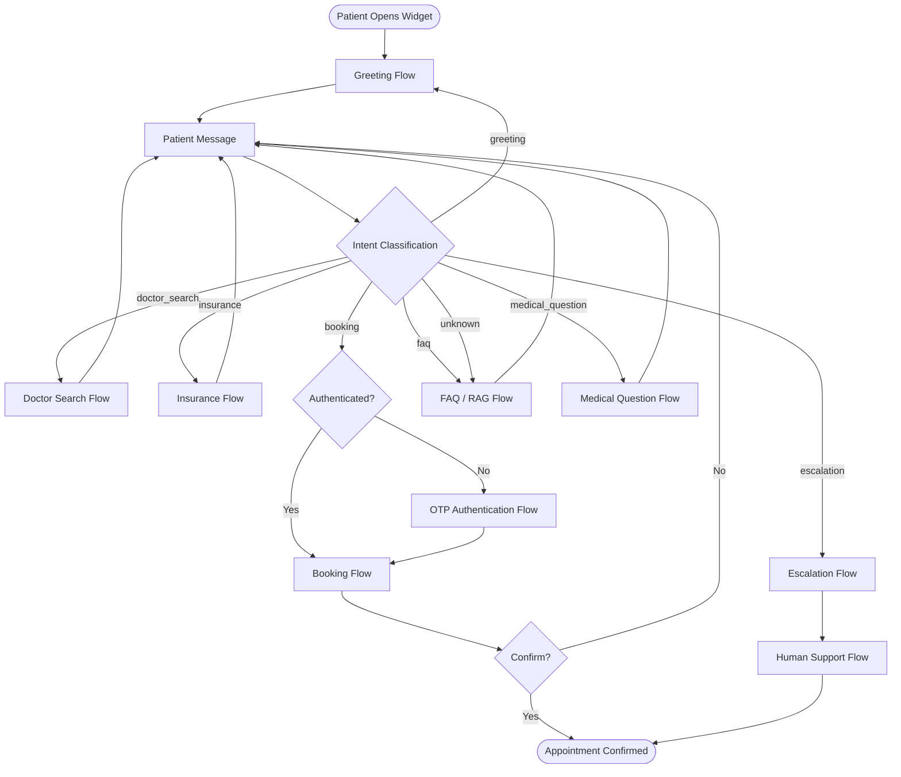

## 8.2 Flow Details

### Greeting Flow

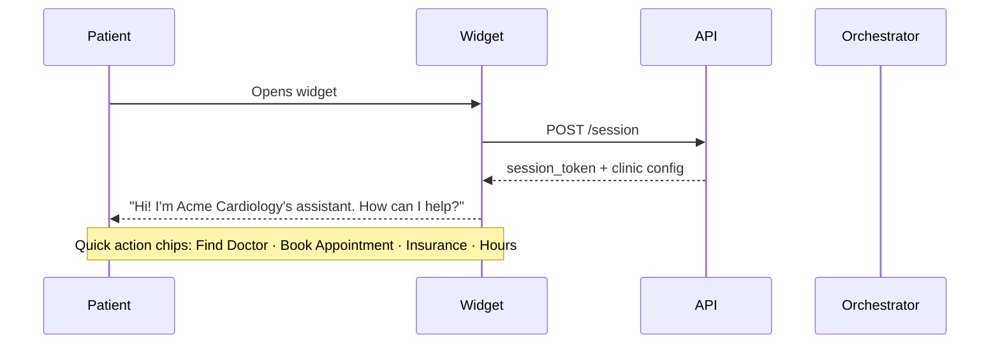

### Doctor Search Flow

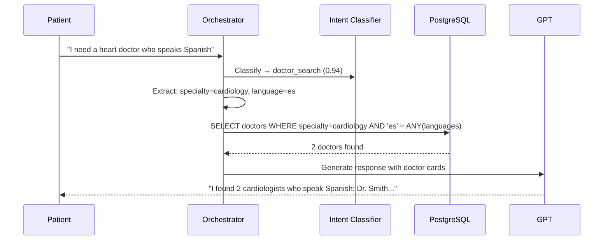

### Insurance Flow

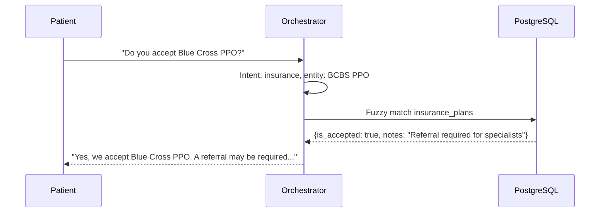

### Booking Flow

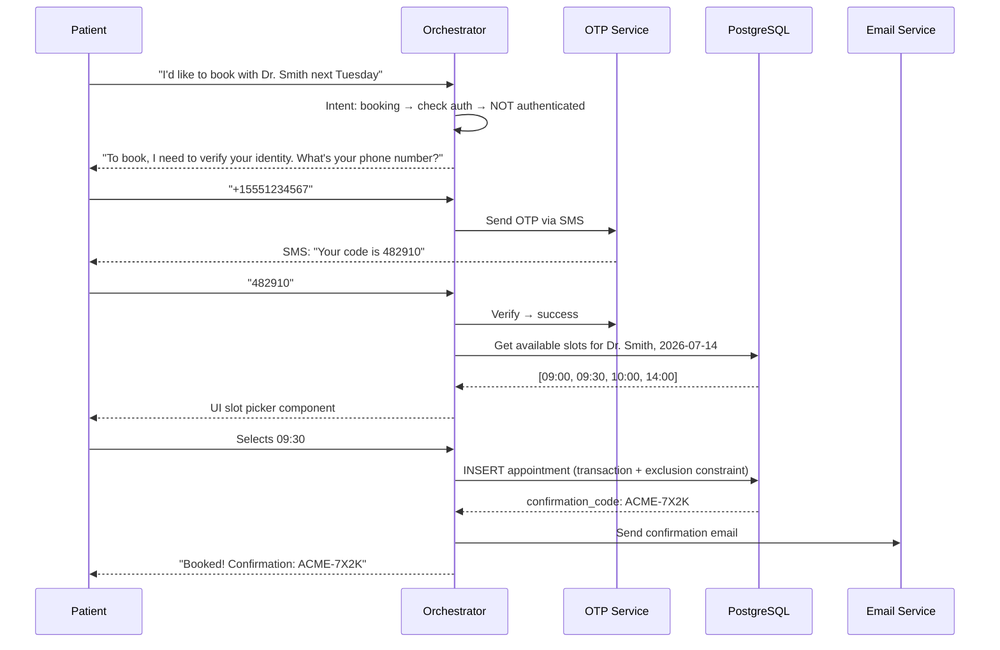

### FAQ Flow

Uses RAG pipeline (Part 9). Short-circuits if pgvector similarity > 0.85 — returns answer without GPT.

### Medical Question Flow

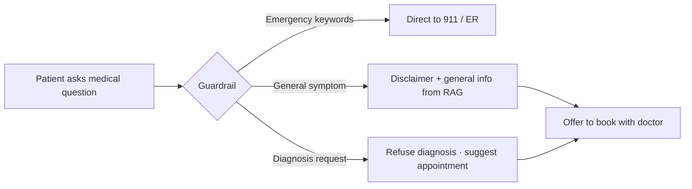

**Hard rules:** Never diagnose. Never prescribe. Always include: *"I'm not a medical professional. Please consult your doctor."*

### Escalation / Human Support Flow

1. Patient says "talk to a person" or bot confidence < 0.4 twice consecutively
2. Create escalation ticket in `chat_sessions` (status = `escalated`)
3. Notify clinic staff via email/Slack webhook
4. Widget shows: "I've connected you with our team. Someone will respond within [X] minutes."
5. Future: live agent handoff via WebSocket

---

# Part 9 — RAG Pipeline

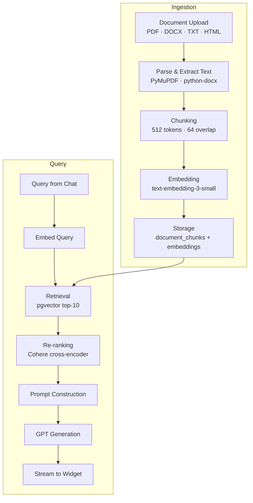

## 9.1 Stage Details

| Stage | Detail |
|---|---|
| **Upload** | Admin uploads via `POST /documents` → S3 → Celery job queued |
| **Parse** | PDF (PyMuPDF), DOCX (python-docx), TXT (direct), HTML (BeautifulSoup) |
| **Chunking** | 512 tokens per chunk, 64-token overlap, split on paragraph boundaries |
| **Embedding** | `text-embedding-3-small` (1536 dims), batch size 100, Celery task |
| **Storage** | `document_chunks` + `embeddings` tables, HNSW index per clinic |
| **Retrieval** | Cosine similarity, `clinic_id` filter, top-10 candidates |
| **Re-ranking** | Cohere Rerank v3 → top-3 chunks (improves precision ~15%) |
| **Prompt construction** | Inject top-3 chunks into system prompt with source attribution |
| **Generation** | GPT-4o-mini with instruction: "Answer only from provided context" |
| **Streaming** | SSE tokens to widget |

## 9.2 Chunking Strategy

```
Document: "Clinic Cancellation Policy"
├── Chunk 0: [tokens 0-512]   "Our cancellation policy requires..."
├── Chunk 1: [tokens 448-960]  "...24 hours notice. Late cancellations..."
└── Chunk 2: [tokens 896-1100] "...may incur a $50 fee."
```

Metadata per chunk: `{document_title, page_number, section_heading, category}`

## 9.3 Hybrid Search (Future Enhancement)

Combine pgvector cosine similarity with PostgreSQL full-text search (`ts_rank`) using Reciprocal Rank Fusion (RRF) for improved recall on exact terms (e.g., insurance plan names).

---

# Part 10 — Multi-Tenant Architecture

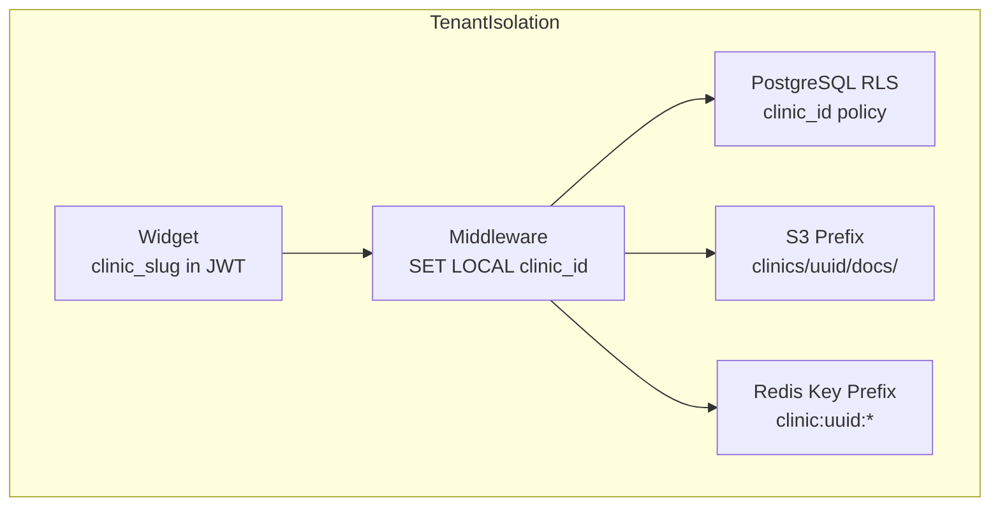

## 10.1 Isolation Layers

| Layer | Mechanism | Failure Mode |
|---|---|---|
| **API** | JWT contains `clinic_id`; middleware validates | 403 Forbidden |
| **Application** | Django middleware sets `app.current_clinic_id` | Request rejected |
| **Database** | RLS policies on all tables | Zero rows returned (not error) |
| **Storage** | S3 path prefix per clinic | Access denied via IAM |
| **Cache** | Redis key namespace `c:{clinic_id}:*` | Cache miss (safe) |
| **AI Context** | Clinic data injected server-side only; never from client | N/A |
| **Embeddings** | pgvector queries always filter `WHERE clinic_id = $1` | Empty results |

## 10.2 JWT Structure

```json
{
  "sub": "session_uuid",
  "clinic_id": "clinic_uuid",
  "type": "widget_session",
  "iat": 1720440000,
  "exp": 1720526400,
  "origins": ["https://acme-clinic.com"]
}
```

## 10.3 Threat Model — Tenant Isolation

| Threat | Mitigation |
|---|---|
| Cross-tenant data access via API | JWT `clinic_id` + RLS double enforcement |
| Clinic A widget on Clinic B site | Origin validation against `clinic_configs.allowed_origins` |
| Embedding search leakage | Mandatory `clinic_id` filter; integration tests per tenant |
| Admin impersonation | RBAC with `clinic_admin` scoped to single `clinic_id` |
| Session fixation | New session token on auth upgrade; rotate on OTP verify |

---

# Part 11 — Background Jobs

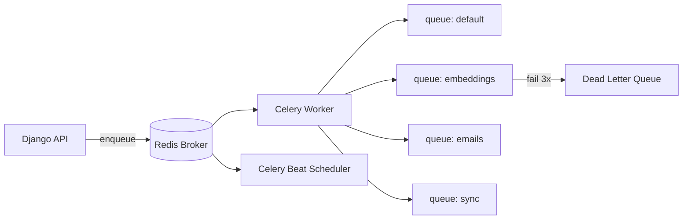

## 11.1 Queue Design

| Queue | Tasks | Concurrency | Priority |
|---|---|---|---|
| `default` | Analytics, audit writes | 4 workers | Normal |
| `embeddings` | Document chunk + embed | 2 workers | Low |
| `emails` | OTP, confirmations, escalations | 4 workers | High |
| `sync` | EHR data sync, bulk imports | 2 workers | Normal |

## 11.2 Retry Policy

| Task | Max Retries | Backoff | DLQ |
|---|---|---|---|
| Embed document | 3 | 60s, 300s, 900s | Yes |
| Send email | 5 | 30s exponential | Yes |
| Sync data | 3 | 120s exponential | Yes |
| Analytics event | 1 | None | No (fire-and-forget) |

## 11.3 Scheduled Jobs (Celery Beat)

| Job | Schedule | Purpose |
|---|---|---|
| `cleanup_expired_sessions` | Every 1h | Purge sessions > 24h inactive |
| `cleanup_expired_otps` | Every 15min | Delete expired OTP records |
| `sync_scheduler` | Per clinic config | Trigger scheduled EHR sync |
| `analytics_aggregation` | Daily 02:00 UTC | Roll up daily analytics per clinic |
| `embedding_reindex` | Weekly | Rebuild HNSW indexes if needed |

---

# Part 12 — Redis Architecture

| Use Case | Key Pattern | TTL | Data Structure |
|---|---|---|---|
| **Session cache** | `sess:{session_id}` | 24h | Hash (context, auth state) |
| **OTP codes** | `otp:{session_id}` | 5min | String (hashed code) |
| **Rate limiter** | `rl:{clinic_id}:{endpoint}:{ip}` | 60s | Counter (INCR + EXPIRE) |
| **Chat stream buffer** | `stream:{message_id}` | 10min | List (token buffer for reconnect) |
| **Embedding cache** | `emb:{clinic_id}:{query_hash}` | 1h | String (cached vector results) |
| **Distributed lock** | `lock:booking:{doctor_id}:{slot}` | 30s | SET NX (prevent double-book) |
| **Celery broker** | `celery:*` | Varies | Lists + pub/sub |
| **Feature flags** | `flags:{clinic_id}` | 5min | Hash (cached from DB) |

## 12.1 Rate Limiter Implementation

```
INCR rl:{clinic}:{endpoint}:{identifier}
EXPIRE rl:{clinic}:{endpoint}:{identifier} 60
IF count > limit → 429 Too Many Requests
```

Uses sliding window via Redis sorted sets at higher scale.

## 12.2 Distributed Booking Lock

```
SET lock:booking:{doctor_id}:{start_time} {session_id} NX EX 30
→ Success: proceed with booking transaction
→ Fail: return 409 "slot being booked by another patient"
DEL lock on transaction commit/rollback
```

---
