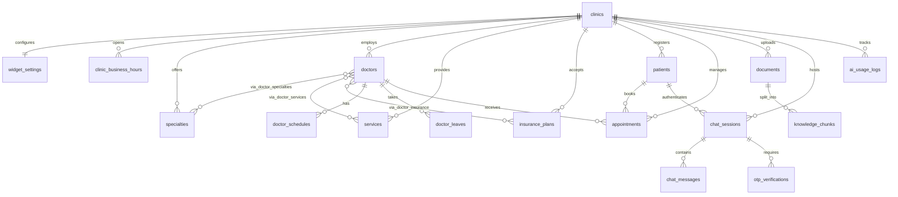

# Synapse — Phase 1 Database Design

**Version:** 1.1  
**Date:** July 14, 2026  
**Status:** Ready for Review (post-architect feedback)  
**Scope:** Database schema only — no APIs, no Django project structure

---

## Changelog (v1.0 → v1.1)

| Change | Detail |
|---|---|
| Patient phone required | `phone VARCHAR(20) NOT NULL` — OTP booking requires phone |
| Split patient name | `first_name` + `last_name` (both NOT NULL); searchable + greetable |
| Soft delete | `is_deleted` + `deleted_at` on doctors, services, specialties, insurance_plans, documents |
| `doctor_services` | M2M — not every doctor performs every service |
| `doctor_insurance` | M2M — clinic may accept a plan that a doctor does not |
| `clinic_business_hours` | Clinic open/closed days vs doctor schedules |
| Appointment statuses | Added `no_show`, `rescheduled` |
| Appointment source enum | `chatbot`, `admin`, `phone`, `walk_in`, `import` |
| Widget settings | Single `configuration` JSONB (replaces four columns) |
| Chat session | `context` → `conversation_context` |
| Chat messages | Added `message_type` enum |
| Knowledge chunks | Added `page_number` |
| Documents | Added `uploaded_by` (nullable UUID until admin users) |
| Patients | Added `preferred_language` |
| AI usage | Added `provider`, `cached_response` |
| Removed | `subscription_tier` — not needed until billing |

---

## Table of Contents

1. [Design Principles](#1-design-principles)
2. [Entity-Relationship Diagram](#2-entity-relationship-diagram)
3. [Table Reference](#3-table-reference)
4. [Indexes & Constraints](#4-indexes--constraints)
5. [JSONB Usage](#5-jsonb-usage)
6. [pgvector & RAG Storage](#6-pgvector--rag-storage)
7. [Multi-Tenancy Strategy](#7-multi-tenancy-strategy)
8. [Performance & Scaling](#8-performance--scaling)
9. [Django Models](#9-django-models)
10. [Migration Strategy](#10-migration-strategy)
11. [Deferred to Later Phases](#11-deferred-to-later-phases)

---

## 1. Design Principles

| Principle | Implementation |
|---|---|
| **Multi-tenancy** | Every tenant-scoped table has `clinic_id NOT NULL` with FK to `clinics` |
| **UUID primary keys** | `gen_random_uuid()` |
| **Soft delete** | Catalog entities soft-deleted to preserve appointment/history FKs |
| **Normalized structure** | 3NF for relational data; JSONB only where flexibility is needed |
| **Denormalized `clinic_id`** | On child tables for tenant filtering and future RLS |
| **Embeddings inline** | `vector(1536)` on `knowledge_chunks` |
| **Chat as rows** | One `chat_messages` row per message |

### Table Count Summary (21 tables)

| Domain | Tables |
|---|---|
| Clinic Management | `clinics`, `widget_settings`, `clinic_business_hours` |
| Medical Information | `specialties`, `doctors`, `doctor_specialties`, `services`, `doctor_services`, `insurance_plans`, `doctor_insurance`, `doctor_schedules`, `doctor_leaves` |
| Patient System | `patients`, `appointments` |
| AI Knowledge | `documents`, `knowledge_chunks` |
| Chat System | `chat_sessions`, `chat_messages` |
| Authentication | `otp_verifications` |
| Analytics | `ai_usage_logs` |

---

## 2. Entity-Relationship Diagram



**DBML file:** [`synapse-schema.dbml`](./synapse-schema.dbml) — import at [dbdiagram.io](https://dbdiagram.io)

---

## 3. Table Reference

### 3.1 `clinics`

Root tenant entity. No `subscription_tier` until billing is implemented.

| Column | Type | Constraints | Description |
|---|---|---|---|
| `id` | `UUID` | PK | |
| `slug` | `VARCHAR(64)` | UNIQUE, NOT NULL | Widget embed identifier |
| `name` | `VARCHAR(255)` | NOT NULL | |
| `email` | `VARCHAR(255)` | NOT NULL | Admin contact |
| `phone` | `VARCHAR(20)` | | Clinic main phone |
| `address` | `JSONB` | DEFAULT `'{}'` | `{street, city, state, zip, country}` |
| `timezone` | `VARCHAR(50)` | NOT NULL | IANA timezone |
| `status` | `VARCHAR(20)` | NOT NULL | `active`, `suspended`, `onboarding` |
| `created_at` / `updated_at` | `TIMESTAMPTZ` | NOT NULL | |

---

### 3.2 `widget_settings`

One-to-one with clinic. **Single `configuration` JSONB** for widget, AI, booking, and feature flags.

| Column | Type | Constraints |
|---|---|---|
| `id` | `UUID` | PK |
| `clinic_id` | `UUID` | FK → clinics, UNIQUE |
| `configuration` | `JSONB` | NOT NULL, DEFAULT `'{}'` |
| `created_at` / `updated_at` | `TIMESTAMPTZ` | |

**Example `configuration`:**
```json
{
  "widget": {
    "primary_color": "#2563EB",
    "position": "bottom-right",
    "greeting": "Hi! How can I help you today?",
    "logo_url": "https://cdn.example.com/logo.png",
    "allowed_origins": ["https://acme-clinic.com"]
  },
  "ai": {
    "model": "gpt-4o-mini",
    "temperature": 0.3,
    "system_prompt_override": null
  },
  "booking": {
    "require_auth": true,
    "slot_duration_min": 30,
    "buffer_min": 5
  },
  "feature_flags": {
    "booking": true,
    "insurance": true,
    "rag": true,
    "doctor_search": true
  }
}
```

---

### 3.3 `clinic_business_hours`

Clinic open hours. Doctor schedules and booking slots must respect these windows.

| Column | Type | Constraints | Description |
|---|---|---|---|
| `id` | `UUID` | PK | |
| `clinic_id` | `UUID` | FK, NOT NULL | |
| `day_of_week` | `SMALLINT` | 0–6, UNIQUE per clinic | 0 = Monday |
| `open_time` | `TIME` | NULL if closed | |
| `close_time` | `TIME` | NULL if closed | |
| `is_closed` | `BOOLEAN` | NOT NULL, DEFAULT false | e.g. Sunday closed |
| `created_at` / `updated_at` | `TIMESTAMPTZ` | | |

**Check:** if `is_closed = false`, then `open_time` and `close_time` required and `close_time > open_time`.

---

### 3.4 `specialties`

Clinic-defined specialties. Soft-deletable.

| Soft delete | `is_deleted`, `deleted_at` |
| Unique | `(clinic_id, slug)` |

---

### 3.5 `doctors`

Clinic doctors. Soft-deletable. Linked to specialties, services, and insurance via junction tables.

| Soft delete | `is_deleted`, `deleted_at` |

---

### 3.6 `doctor_specialties` (M2M)

`(doctor_id, specialty_id)` PK + denormalized `clinic_id`.

---

### 3.7 `services`

Clinic services. Soft-deletable.

---

### 3.8 `doctor_services` ⭐ (new)

**Why:** Not every cardiologist performs every cardiology procedure. Answers: *"Does Dr. Rajat perform MRI?"*

| Column | Type | Constraints |
|---|---|---|
| `doctor_id` | `UUID` | PK, FK → doctors |
| `service_id` | `UUID` | PK, FK → services |
| `clinic_id` | `UUID` | NOT NULL, FK → clinics |

---

### 3.9 `insurance_plans`

Clinic-level accepted plans. Soft-deletable.

---

### 3.10 `doctor_insurance` ⭐ (new)

**Why:** Clinic may accept BlueCross, but Doctor A may not.

| Column | Type | Constraints |
|---|---|---|
| `doctor_id` | `UUID` | PK, FK → doctors |
| `insurance_plan_id` | `UUID` | PK, FK → insurance_plans |
| `clinic_id` | `UUID` | NOT NULL, FK → clinics |

---

### 3.11 `doctor_schedules`

Recurring weekly availability. Must fall within `clinic_business_hours`.

---

### 3.12 `doctor_leaves`

Blocks availability (vacation, sick days).

---

### 3.13 `patients`

| Column | Type | Constraints | Description |
|---|---|---|---|
| `id` | `UUID` | PK | |
| `clinic_id` | `UUID` | FK, NOT NULL | |
| `phone` | `VARCHAR(20)` | **NOT NULL**, UNIQUE per clinic | Required for OTP |
| `email` | `VARCHAR(255)` | Partial unique | Optional |
| `first_name` | `VARCHAR(100)` | **NOT NULL** | Searchable; greetings |
| `last_name` | `VARCHAR(100)` | **NOT NULL** | |
| `date_of_birth` | `DATE` | | |
| `preferred_language` | `VARCHAR(10)` | NOT NULL, DEFAULT `'en'` | |
| `is_verified` | `BOOLEAN` | DEFAULT false | Set after OTP |
| `metadata` | `JSONB` | DEFAULT `'{}'` | |
| `created_at` / `updated_at` | `TIMESTAMPTZ` | | |

Indexes on `(clinic_id, first_name)` and `(clinic_id, last_name)` for dashboard search.

---

### 3.14 `appointments`

| Column | Type | Constraints |
|---|---|---|
| `status` | `VARCHAR(20)` | `pending`, `confirmed`, `cancelled`, `completed`, **`no_show`**, **`rescheduled`** |
| `source` | `VARCHAR(20)` | **`chatbot`**, **`admin`**, **`phone`**, **`walk_in`**, **`import`** |

Double-booking exclusion ignores `cancelled` and `rescheduled`.

---

### 3.15 `documents`

Soft-deletable. `uploaded_by UUID` nullable until clinic admin users exist (Phase 4/8).

---

### 3.16 `knowledge_chunks`

| Column | Type | Description |
|---|---|---|
| `chunk_number` | `INTEGER` | Order within document |
| `page_number` | `INTEGER` | Source PDF page (debugging / citations) |
| `content` | `TEXT` | Chunk text |
| `embedding` | `vector(1536)` | NULL until embedded |
| `metadata` | `JSONB` | `{section, heading}` — page also in column |

---

### 3.17 `chat_sessions`

| Column | Notes |
|---|---|
| `conversation_context` | Renamed from `context` — booking flow state, current intent |

---

### 3.18 `chat_messages`

| Column | Values |
|---|---|
| `role` | `user`, `assistant`, `system`, `tool` |
| `message_type` | `text`, `tool_call`, `tool_result`, `system`, `error` |

**`metadata` shape (convention, not schema-enforced):**
```json
{
  "intent": "BOOK_APPOINTMENT",
  "entities": {
    "doctor": "Rajat",
    "date": "Tomorrow"
  },
  "latency": 310,
  "tool_called": "check_availability"
}
```

---

### 3.19 `otp_verifications`

Unchanged — phone OTP before booking.

---

### 3.20 `ai_usage_logs`

| Column | Type | Description |
|---|---|---|
| `provider` | `VARCHAR(50)` | `openai`, `anthropic`, `gemini`, `cache` |
| `cached_response` | `BOOLEAN` | True when Redis answered without GPT |
| `cost_microcents` | `BIGINT` | Cost × 10,000; zero on cache hits |

Enables GPT cost vs Redis cache-hit analysis.

---

## 4. Indexes & Constraints

### Soft-delete query convention
```sql
WHERE clinic_id = $1 AND is_deleted = false
```
Partial indexes on catalog tables filter `WHERE is_deleted = false`.

### Unique Constraints

| Table | Constraint |
|---|---|
| `clinics` | `slug` |
| `widget_settings` | `clinic_id` |
| `clinic_business_hours` | `(clinic_id, day_of_week)` |
| `specialties` | `(clinic_id, slug)` |
| `patients` | `(clinic_id, phone)` |
| `patients` | `(clinic_id, email)` partial |
| `knowledge_chunks` | `(document_id, chunk_number)` |
| `chat_sessions` | `session_token` |
| `chat_messages` | `(session_id, sequence_number)` |
| `appointments` | `confirmation_code` |

### Check Constraints (highlights)

```sql
CHECK (status IN ('pending','confirmed','cancelled','completed','no_show','rescheduled'))
CHECK (source IN ('chatbot','admin','phone','walk_in','import'))
CHECK (message_type IN ('text','tool_call','tool_result','system','error'))
CHECK (provider IN ('openai','anthropic','gemini','cache'))
```

---

## 5. JSONB Usage

| Table | Column | Purpose |
|---|---|---|
| `clinics` | `address` | Display only |
| `widget_settings` | `configuration` | All widget/AI/booking/flags |
| `doctors` | `metadata` | Education, certifications |
| `insurance_plans` | `metadata` | Extra plan details |
| `documents` | `metadata` | Upload metadata |
| `knowledge_chunks` | `metadata` | Section/heading (page in column) |
| `chat_sessions` | `conversation_context` | Flow state machine |
| `chat_messages` | `metadata` | Intent, entities, latency, tools |
| `ai_usage_logs` | `metadata` | Request details |
| `patients` | `metadata` | Extensible demographics |

Structured medical / booking data remains relational.

---

## 6. pgvector & RAG Storage

Same as v1.0: embeddings live on `knowledge_chunks.embedding vector(1536)` with HNSW + optional FTS GIN index.

`page_number` is a first-class column for citations and debugging without digging into JSONB.

---

## 7. Multi-Tenancy Strategy

Unchanged: denormalized `clinic_id` everywhere; app-level filtering first; RLS in Phase 8.

---

## 8. Performance & Scaling

Unchanged targets. New indexes added for:

- Patient name search `(clinic_id, first_name)`, `(clinic_id, last_name)`
- Doctor↔service / doctor↔insurance junction lookups
- AI cache-hit analytics `(clinic_id, cached_response, created_at)`
- Message type filtering `(session_id, message_type)`

---

## 9. Django Models

Reference: [`django_models.py`](./django_models.py)

Includes `SoftDeleteModel` mixin and all v1.1 relationships.

---

## 10. Migration Strategy

| Step | Migration | Description |
|---|---|---|
| 1 | `0001_enable_extensions` | `vector`, `btree_gist`, `pgcrypto` |
| 2 | `0002_clinics` | clinics + widget_settings + clinic_business_hours |
| 3 | `0003_medical` | specialties, doctors, services, insurance + M2M tables |
| 4 | `0004_scheduling` | doctor_schedules, doctor_leaves |
| 5 | `0005_patients` | patients, appointments + exclusion |
| 6 | `0006_knowledge` | documents, knowledge_chunks + HNSW |
| 7 | `0007_chat` | chat_sessions, chat_messages |
| 8 | `0008_auth` | otp_verifications |
| 9 | `0009_analytics` | ai_usage_logs |
| 10 | `0010_rls` | Row-level security (production) |

**Raw SQL:** [`migrations/001_initial_schema.sql`](./migrations/001_initial_schema.sql)

---

## 11. Deferred to Later Phases

| Item | Phase | Reason |
|---|---|---|
| Clinic admin users | Phase 4 / 8 | `uploaded_by` stays nullable UUID until then |
| Subscription / billing fields | Later | Explicitly removed from MVP |
| `email_logs`, `audit_logs` | Phase 8 | Production hardening |
| RLS policies | Phase 8 | App-level filtering for MVP |
| Table partitioning | Phase 8 | Wait for volume |

---

## Approval Checklist

- [x] Patient phone + first/last name required
- [x] Soft delete on catalog entities
- [x] `doctor_services` + `doctor_insurance`
- [x] `clinic_business_hours`
- [x] Appointment statuses include no_show / rescheduled
- [x] Appointment source enum
- [x] Single widget `configuration` JSONB
- [x] `message_type`, `page_number`, `provider`, `cached_response`
- [x] `subscription_tier` removed

**Next phase:** Phase 2 — Django project structure, PostgreSQL + pgvector + Redis + Celery configuration.
